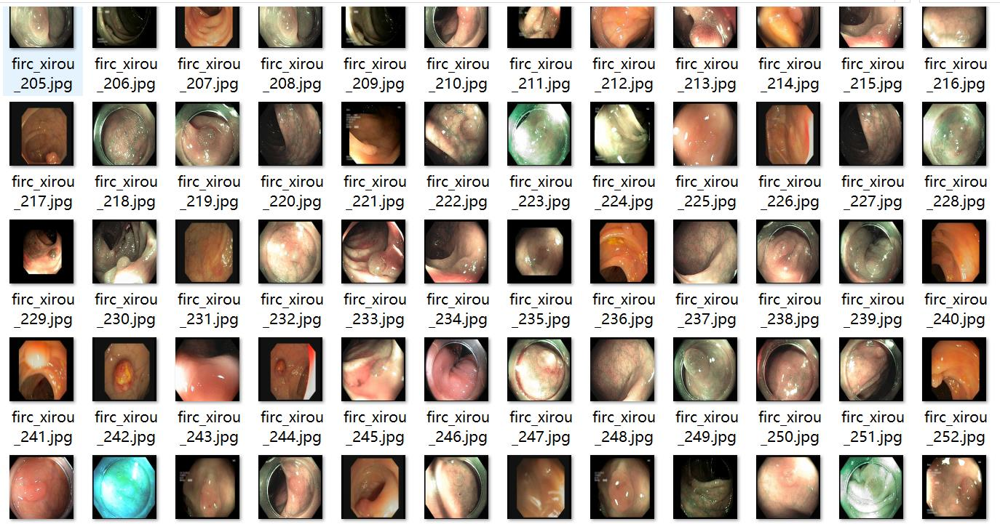

# Wisdom Medical Endoscopic Polyp Detection Data Set (VOC+YOLO Format)

**Dataset Format:** Pascal VOC format + YOLO format (txt file without split path, only contains jpg images and corresponding VOC format xml files and YOLO format txt files)

**Number of Images (jpg File Count):** 9248

**Number of Annotations (xml File Count):** 9248

**Number of Annotations (txt File Count):** 9248

**Number of Annotation Categories:** 2

**Annotation Category Names:** ["AP", "MP"]

**Box Count for Each Classification:**
- AP Adenomatous Polyp (Adenomatous Polyp) Box Count = 4367
- MP Hyperplastic Polyp (Hyperplastic Polyp) Box Count = 4881

**Total Box Count:** 9248

**Image Resolution:** 640x640

**Annotation Tool:** labelImg

**Annotation Rules:** Draw a rectangle around the category

**Important Notes:** None

**Special Disclaimer:** This dataset does not guarantee the accuracy of trained models or weight files.

**Image Preview:**

Image

Here is a pay link on Stripe ( https://buy.stripe.com/3cs8yP7sY87d0vu9AB ). Please contact me lonlonago@foxmail.com after funding $89, and I will send you a complete data files , thank you!

